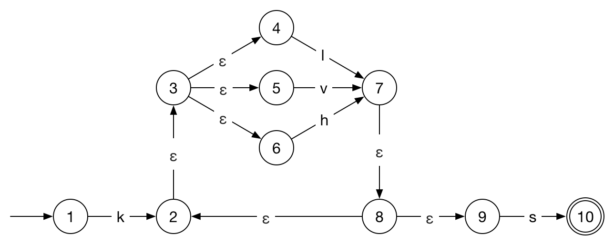
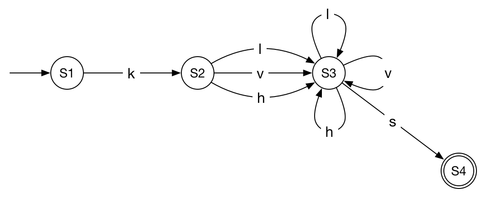
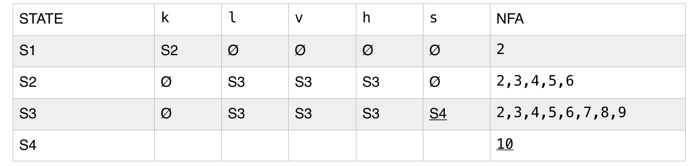
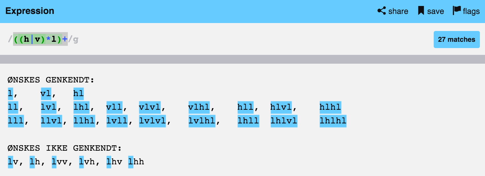

# Opgave 1

### Opgave 1.1

* kls
* klllllls
* klvhls
* khhhs
* kvs

Det regulære udtryk beskriver sproget, hvor
ét k
altid efterfølges af et eller flere l, v eller h,
for til sidst at have ét s.

### Opgave 1.2


Jeg har anvendt reglerne beskrevet i Mogensens _"Introduction to Compiler Design"_, beskrevet i kap. 1, til generering af NFA'en.


### Opgave 1.3


Jeg har anvendt matrix-metoden, vist til forelæsningerne i faget, til konvertering af NFA til DFA. Matricen jeg endte med kan ses her:  



### Opgave 1.4
Jeg er kommet frem til det regulære udtryk ```((h|v)*l)+```, der beskriver den angivne mængde strenge.

Ved at teste udtrykket, kan jeg se, at strengene ```lv, lh, lvv, lvh, lhv``` og ```lhh``` som ønsket ikke genkendes.


