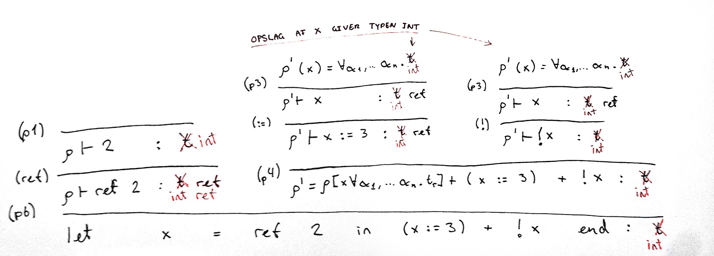

# Opgave 2

### Opgave 2.1
```Absyn.fs``` er ændret ved at tilføje følgende typer:

	type expr =
        ...
      | Ref of expr
      | Deref of expr
      | UpdRef of expr * expr

### Opgave 2.2 & 2.3
```HigherFun.fs``` er ændret ved at tilføje følgende type:

	type value =
	  ...      
	  | RefVal of value ref

Hermed kan reference-typer repræsenteres.

Derudover er ```eval``` ændret: 

	let rec eval (e : expr) (env : value env) : value =
		match e with
		...
		| Ref e -> RefVal (ref (eval e env))
		| Deref e ->
		  let v = eval e env
		  match v with
		  | RefVal v' -> !v'
		  | _         -> failwith "%A is not a reference type." v
		| UpdRef(e1, e2) ->
		  let v1 = eval e1 env
		  match v1 with
		  | RefVal v1' -> let v2 = eval e2 env
		                  v1' := v2
		                  v2
		  | _          -> failwith "%A is not a reference type." e1

Hermed muliggøres evaluering af reference-typer. 

En ```Ref e``` evaluerer ```e```. 

En ```Deref e``` evaluerer ```e```, _pattern matcher_ på resultatet for at sikre, at ```e``` er en reference-type, og returnerer til sidst resultatet, hvis dette er tilfældet. Hvis ikke fejler funktionen. 

En ```UpdRef (e1, e2)``` evaluerer ```e1```, _pattern matcher_ igen på resultatet for at sikre, at ```e1``` er en reference-type, evaluerer ```e2```, og tildeler resultatet til e1. Til slut returneres ```e2```. Hvis ```e1``` ikke er en reference-type, fejler funktionen. 

### Opgave 2.4
I eksemplerne der ses nedenfor er det abstrakte syntakstræ efterfulgt af det Micro-ML, det repræsenterer, efterfulgt af resultatet af evalueringen af træet. 

	let ex1 = Let ("x",Ref (CstI 2), Let ("y",Ref (CstI 3), UpdRef (Var "y",Prim ("+",Deref (Var "x"), Deref (Var "y")))))
	
	let x = 2 in 
	  let y = 3 in 
	    y = x + y
	  end
	end

    val it : HigherFun.value = Int 5
-


    let ex2 = Let ("x", Ref (CstI 1), UpdRef (Var "x", CstI 2))
    
    let x = 1 in 
      x = 2
    end   
    
    val it : HigherFun.value = Int 2
-
	       
	let ex3 = Let ("y", Ref (CstI 1), UpdRef (Var "y", Deref (Var "y")))	
	
	let y = 1 in 
	  y = y
	end
	
	val it : HigherFun.value = Int 1
-
	    
	let ex4 = Letfun ("deref", "x", Deref(Var "x"),Call (Var "deref",Ref (CstI 2)))
	
	let deref x = !x in f ref 2 end
	
	val it : HigherFun.value = Int 2

### Opgave 2.5
Følgende ændringer er lavet i ```FsLex.fsl```:

    let keyword s = 
        ...
	    | "ref"   -> REF
        ...
	    
	 let token = parse
	    ...
	    | '!'             { DEREF }
	    | ":="            { ASSIGN }
	    ...

Følgende ændringer er lavet i ```FunPar.fsy```:

	%token ELSE END FALSE IF IN LET NOT THEN TRUE REF
	%token EQ NE GT LT GE LE DEREF ASSIGN
	
	%left EQ NE
	%right REF
	%right DEREF
	...
	%right ASSIGN
	%nonassoc NOT
	
	Expr: 
	  ...
	  | DEREF Expr         { Deref($2)      }
	  | Expr ASSIGN Expr   { UpdRef($1, $3) }
	  
	AtExpr:
	  ...
	  | REF Expr           { Ref $2         }

```ref```er oprettet som keyword, ```!``` og ```:=``` er oprettet som tokens, hhv. ```DEREF``` og ```ASSIGN```.

Ovenstående er højre-associative, da f.eks ```y!x``` binder sig til at hente værdien af ```x```, ```ref``` binder sig til værdien på højre side, og ```:=``` assigner venstre-siden med værdien på højre side. 

```DEREF Expr``` parses som ovenstående, da en ```Expr``` godt kan resultere i en reference-type, og parseren derfor ikke kan være strengere. 

Det samme gælder for ```ASSIGN``` (dog tjekkes der for lovlige reference-typer i ```eval``` efterfølgende).

### Opgave 2.6
	let ex1 = fromString "let x = ref 1 in if !x = 1 then x := 2 else 42 end";;
	val ex1 : Absyn.expr =
	  Let
	    ("x",Ref (CstI 1),
	     If (Prim ("=",Deref (Var "x"),CstI 1),UpdRef (Var "x",CstI 2),CstI 42))
	
	> run ex1;;
	val it : HigherFun.value = Int 2

-

	let ex2 = fromString "let x = ref 2 in (x := 3) + !x end";;
	
	val ex2 : Absyn.expr =
	  Let ("x",Ref (CstI 2),Prim ("+",UpdRef (Var "x",CstI 3),Deref (Var "x")))
	
	> run ex2;;  
	val it : HigherFun.value = Int 6


### Opgave 2.7

Håndskrevet typetræ. Jeg er kommet til at skrive typereglen til venstre i stedet for højre, modsat Sestofts PLC.  

Rød markerer senere indsættelse af funden type.